<h2 align="center">Ícaro Lima</h2>

  Desenvolvedor Full Stack especializado na construção de aplicações web completas e escaláveis, com expertise sólida em Django no backend, TypeScript no frontend e SQL. Desenvolvo soluções end-to-end que integram interfaces modernas e performáticas com APIs robustas, entregando sistemas confiáveis, fáceis de manter e com excelente experiência do usuário.

---

<h3 align="center">Stack Principal</h3>

  

---

<h3 align="center">Atividade no GitHub</h3>

  

  

